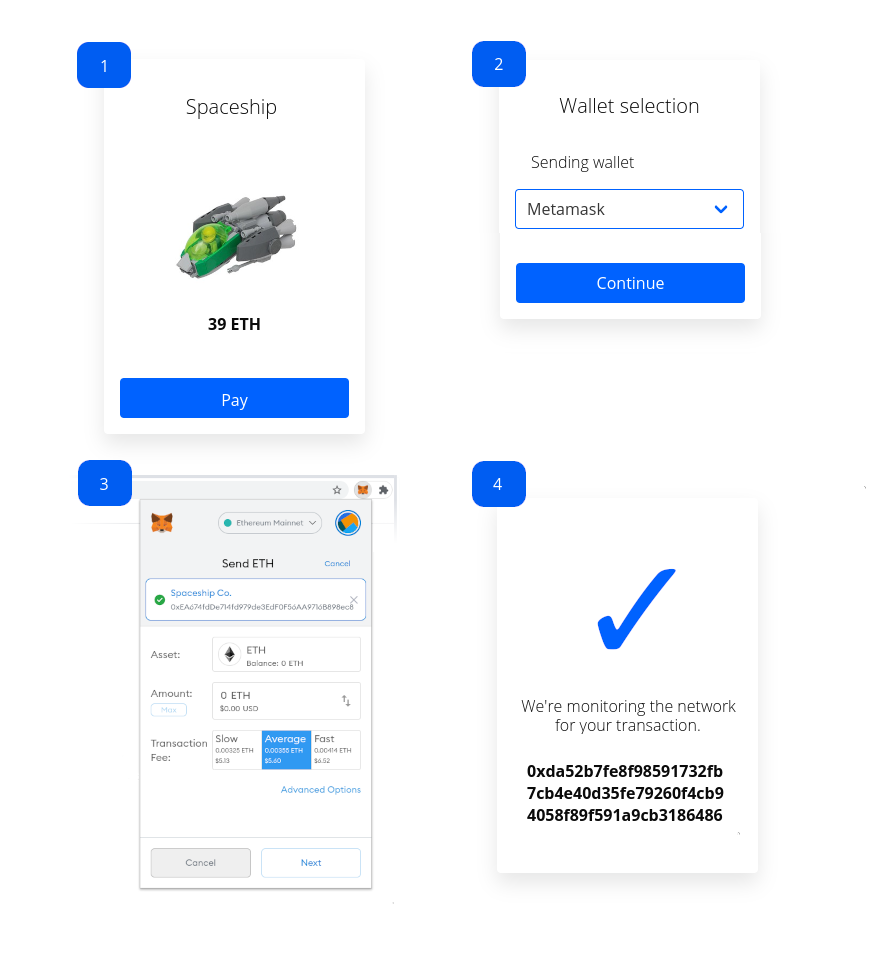
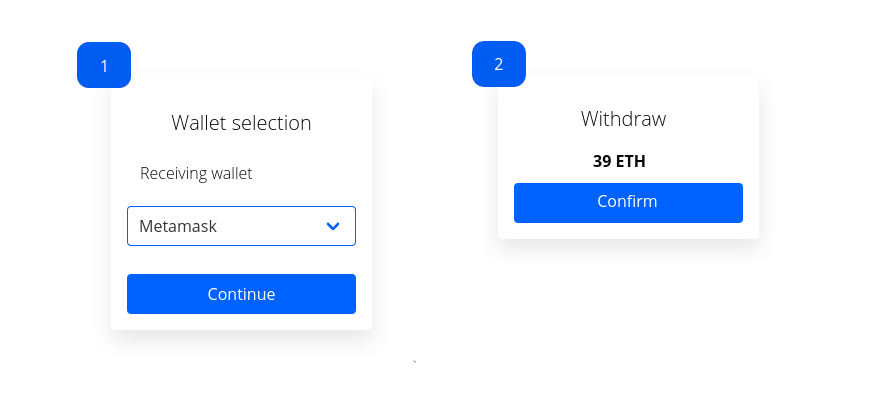

# Orianne - Web browser cryptocurrency wallet abstraction

Orianne wants to help in the situation where a provider requests a payment from
a user, the user wants to pay with a digital wallet, and the provider wants a
bit of feedback about the transaction, such as a transaction hash.



Or maybe when a user wants to withdraw some funds:



The purpose of this software is to expose an abstraction over cryptocurrency
wallets which are accessible from a web browser. The abstraction is not
expected to expose all the unique features of each wallet, but features which
are similar to them all.

The abstraction does not use third party cryptocurrency nodes or nodes provided
by the integrator. For features which might require them, like selecting the
next unused address from an extended public key (xpub), it is expected that the
wallet itself is able to independently obtain the information it requires. In
case the wallet is unable to provide an address (and only provides an xpub),
then the first address is used (unless the wallet is also able to indicate
which address to use).


## Support

There is currently support for the following wallets:

* BitBox02-Multi
* Metamask
* Trezor
* Ledger

The features exposed are:

* `getAnyCryptoAddress(): Promise<CryptoAddress>`
  * `sign(message: UInt8Array): Promise<UInt8Array>`
  * `pay(toAddress: string, amountInStandardDenomination: string): Promise<Payment>`

Orianne is designed to be extensible and hard to misuse. For this reason,
it uses the singleton design pattern and not meant to have more than one
instance. This prevents those situations where the developer might mistake money
going one place, when really it's going to another.


## Usage

The developer installs it in their project: `npm install @bity/orianne`.

They determine the current wallet support meets their needs, and begin writing
code which uses the package:

```typescript
import { Orianne, Networks, Wallets } from '@bity/orianne';

const orianne = new Orianne();

// Put the batteries in!
orianne.addDefaultWallets();

let userAddress;
const merchantAddress = '...';

// Make a payment in Ethereum using Metamask.
orianne.useWallet(Networks.ETH, Wallets.Metamask);
userAddress = await orianne.getAnyCryptoAddress();
userAddress.pay(merchantAddress, '1.32234') // 1.32234 ETH
  .then((/* don't care about payment information */) => alert('paid!'))
  .catch((e) => alert('error when paying!', e));
  
// And maybe then we want to make a transaction with Trezor.
orianne.useWallet(Networks.ETH, Wallets.Trezor);
userAddress = await orianne.getAnyCryptoAddress();
userAddress pay(merchantAddress, '100.0') // 100 ETH still!
  .then(() => alert('paid!'))
  .catch((e) => alert('error when paying!', e));
  
// Again Trezor, but specifically for Bitcoin!
orianne.useWallet(Networks.Bitcoin, Wallets.Trezor);
userAddress = await orianne.getAnyCryptoAddress();
userAddress.pay(merchantAddress, '0.5234') // 0.5234 BTC
  .then(() => alert('paid!'))
  .catch((e) => alert('error when paying!', e));
```

Maybe the developer wants to present all possible networks and wallets which are
registered in orianne (but possibly not available in the browser):

```typescript
// Continuing from the code above...
const allNetworks = orianne.networks;
const allWallets = orianne.networks.values().flatMap(i => i);

// Or maybe they want to only show it for a certain network.
const wallets = orianne.networks.get(Networks.Bitcoin);
alert(wallets);
```


## Extension

The developer determines the `@bity/orianne` package does not meet their
requirements and needs to extend it to support a new wallet which is normally
accessible through a web browser.

```typescript
import { CryptoAddress, Orianne, WalletInterface } from '@bity/orianne';

const orianne = new Orianne();

// See wallets/dummy.ts for a real implementation.
class Giga implements WalletInterface {
  constructor(...) { ... }
  initialize(): Promise<this> { ... }
  getAnyCryptoAddress(): Promise<CryptoAddress> { ... }
}

// Adds it to the 'Alphacoin' network, under the 'Giga' token.
const AlphacoinNetwork = 'Alphacoin';
const GigaWallet = 'Giga';
orianne.addWallet(AlphacoinNetwork, GigaWallet, Giga);
orianne.useWallet(AlphacoinNetwork, GigaWallet);
const userAddress = await orianne.getAnyCryptoAddress();
userAddress.pay(merchantAddress, '100') // 100 alphas
  .then(() => alert('paid!'))
  .catch((e) => alert('error when paying!', e));
```
